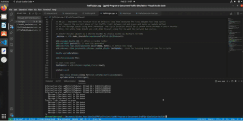

### Hi there 👋

## About
My name is [Kishan Savant](https://www.linkedin.com/in/kishan-savant/). Software engineer and an Open Source enthusiast with interest in Robotics and Machine Learning. I have recently completed Nanodegree progams in C++ and Self-Driving Car Engineer from [Udacity](https://www.udacity.com/) platform. I have three years of experience working in the US after my Masters Degree as a Lead Engineer at a startup tech incubator where I worked with early stage startups to build hardware and software prototypes.Currently working as a software engineer at a product company.

As an open source enthusiast, I try to contribute time and again to the open source projects of my interest.

## Open Source Contributions

#### Voxel51

[![Kishan%20Savant Badge](https://img.shields.io/badge/Kishan%20Savant-blue.svg?logo=data:image/svg+xml;base64,PD94bWwgdmVyc2lvbj0iMS4wIiA/PjxzdmcgeG1sbnM9Imh0dHA6Ly93d3cudzMub3JnLzIwMDAvc3ZnIiB4bWxuczp4bGluaz0iaHR0cDovL3d3dy53My5vcmcvMTk5OS94bGluayIgdmVyc2lvbj0iMS4xIiBpZD0iTGF5ZXJfMSIgeD0iMHB4IiB5PSIwcHgiIHZpZXdCb3g9IjAgMCA1MjAuNyA0NzIuNyIgc3R5bGU9ImVuYWJsZS1iYWNrZ3JvdW5kOm5ldyAwIDAgNTIwLjcgNDcyLjc7IiB4bWw6c3BhY2U9InByZXNlcnZlIj4KPHN0eWxlIHR5cGU9InRleHQvY3NzIj4KCS5zdDB7ZmlsbDp3aGl0ZTt9Cgkuc3Qxe2ZpbGw6d2hpdGU7fQo8L3N0eWxlPgo8ZyBpZD0ic3VyZmFjZTEiPgoJPHBhdGggY2xhc3M9InN0MCIgZD0iTTEyMC45LDQzLjJjMC0yLjIsMS4zLTMuNSwyLjItMy44YzAuNi0wLjMsMS4zLTAuNiwyLjItMC42YzAuNiwwLDEuNiwwLjMsMi4yLDAuNmwxMy43LDhMMTY3LjYsMzJsLTI2LjgtMTUuMyAgIGMtOS42LTUuNC0yMS4xLTUuNC0zMSwwYy05LjYsNS44LTE1LjMsMTUuNy0xNS4zLDI2Ljh2Mjg2LjNsMjYuMiwxNS4zdi0zMDJoMC4yVjQzLjJ6Ii8+Cgk8cGF0aCBjbGFzcz0ic3QwIiBkPSJNMTI3LjksNDI5LjZjLTEuOSwxLTMuOCwwLjYtNC41LDBjLTEtMC42LTIuMi0xLjYtMi4yLTMuOHYtMTUuN0w5NSwzOTQuN3YzMWMwLDExLjIsNS44LDIxLjEsMTUuMywyNi44ICAgYzQuOCwyLjksMTAuMiw0LjIsMTUuMyw0LjJjNS40LDAsMTAuNS0xLjMsMTUuMy00LjJMNDAyLDMwMS43di0zMC40TDEyNy45LDQyOS42eiIvPgoJPHBhdGggY2xhc3M9InN0MCIgZD0iTTQ3Mi40LDIwNy44bC0yNDgtMTQzLjJsLTI2LjUsMTVMNDU5LDIzMC41YzEuOSwxLjMsMi4yLDIuOSwyLjIsMy44cy0wLjMsMi45LTIuMiwzLjhsLTExLjgsNi43djMwLjQgICBsMjQuOS0xNC40YzkuNi01LjQsMTUuMy0xNS43LDE1LjMtMjYuOEM0ODcuNywyMjMuMSw0ODIsMjEzLjIsNDcyLjQsMjA3Ljh6Ii8+Cgk8cGF0aCBjbGFzcz0ic3QxIiBkPSJNNzkuNywzNjguNWwyMi43LDEzLjFsMjYuMiwxNS4zbDcuNyw0LjVsNS40LDMuMmw5NS41LTU1LjN2LTk1LjJjMC0xMi4xLDYuNC0yMy4zLDE2LjktMjkuNGw4Mi40LTQ3LjYgICBMMTkwLjIsOTIuOGwtMjIuNy0xMy4xbDIyLjctMTMuMWwyNi4yLTE1LjNsNy43LTQuNWw3LjcsNC41bDE2MSw5My4zbDMuMi0xLjljOS4zLTUuNCwyMS4xLDEuMywyMS4xLDEyLjF2My44bDE1LDguNlYxNDIgICBjMC0xMi41LTYuNy0yNC0xNy4zLTMwTDI1NC41LDE5LjNjLTEwLjktNi40LTI0LTYuNC0zNC44LDBMMTM2LDY3LjZ2MzAzLjJsLTIyLjctMTMuMUw4NywzNDIuM2wtNy4zLTQuMnYtMjM4bC0yMC4xLDExLjUgICBjLTEwLjksNi4xLTE3LjMsMTcuNi0xNy4zLDMwdjE4NWMwLDEyLjUsNi43LDI0LDE3LjMsMzBMNzkuNywzNjguNXoiLz4KCTxwYXRoIGNsYXNzPSJzdDEiIGQ9Ik00MTcuMSwyMjMuOHY5NC45YzAsMTIuMS02LjQsMjMuMy0xNi45LDI5LjRsLTE0MS45LDgyLjFjLTkuMyw1LjQtMjEuMS0xLjMtMjEuMS0xMi4xdi0zLjhMMTk3LjksNDM3ICAgbDIxLjcsMTIuNWMxMC45LDYuNCwyNCw2LjQsMzQuOCwwTDQxNC42LDM1N2MxMC45LTYuNCwxNy4zLTE3LjYsMTcuMy0zMHYtOTQuNkw0MTcuMSwyMjMuOHoiLz4KPC9nPgo8L3N2Zz4=&label=contributor&labelColor=212529)](https://github.com/voxel51/fiftyone/commits?author=NeoKish)

## Recent Projects

<!-- <h3 align = "center" > UdacityCPPCapstone- Snake Game </h3> -->

  

 

   
   

  
 

   
   

<!--
**NeoKish/NeoKish** is a ✨ _special_ ✨ repository because its `README.md` (this file) appears on your GitHub profile.

Here are some ideas to get you started:

- 🔭 I’m currently working on ...
- 🌱 I’m currently learning ...
- 👯 I’m looking to collaborate on ...
- 🤔 I’m looking for help with ...
- 💬 Ask me about ...
- 📫 How to reach me: ...
- 😄 Pronouns: ...
- ⚡ Fun fact: ...
-->
